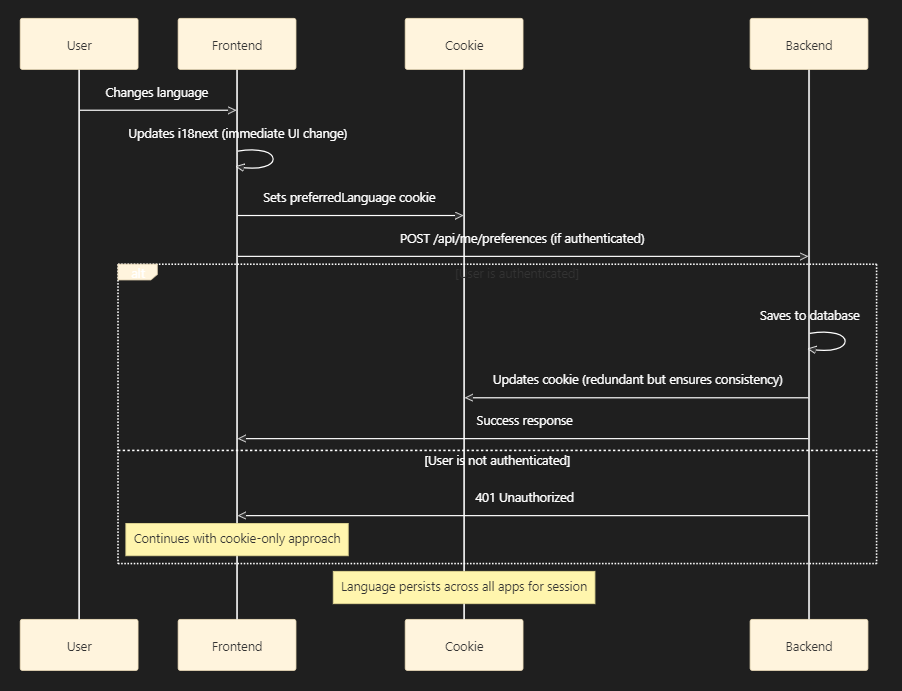
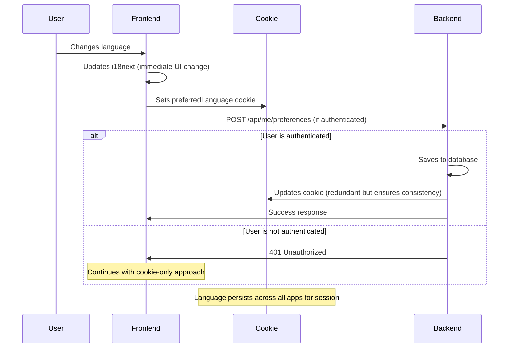

# i18n Quick Reference Card

## 🚀 Quick Start

### 1. Initialize in your app

```tsx
import { initI18n } from '@asafarim/shared-i18n';

initI18n();  // Call before rendering
```

### 2. Use translations in components

```tsx
import { useTranslation } from '@asafarim/shared-i18n';

function MyComponent() {
  const { t } = useTranslation();
  return <h1>{t('welcome')}</h1>;
}
```

### 3. Add language switcher

```tsx
import { LanguageSwitcher } from '@asafarim/shared-ui-react';

<LanguageSwitcher variant="toggle" />
```

## 📚 Common Translation Keys

| Key | English | Dutch |
|-----|---------|-------|
| `welcome` | Welcome | Welkom |
| `login` | Login | Inloggen |
| `logout` | Logout | Uitloggen |
| `email` | Email | E-mail |
| `password` | Password | Wachtwoord |
| `submit` | Submit | Verzenden |
| `cancel` | Cancel | Annuleren |
| `save` | Save | Opslaan |
| `delete` | Delete | Verwijderen |
| `search` | Search | Zoeken |
| `loading` | Loading... | Laden... |
| `home` | Home | Home |
| `about` | About | Over ons |
| `contact` | Contact | Contact |
| `services` | Services | Diensten |

## 🎨 LanguageSwitcher Variants

```tsx
// Dropdown (default)
<LanguageSwitcher variant="dropdown" />

// Toggle button
<LanguageSwitcher variant="toggle" />

// With custom className
<LanguageSwitcher variant="toggle" className="my-custom-class" />
```

## 🪝 useLanguage Hook

```tsx
import { useLanguage } from '@asafarim/shared-i18n';

function LanguageSettings() {
  const { language, changeLanguage, isChanging } = useLanguage();
  
  return (
    <div>
      <p>Current: {language}</p>
      <button 
        onClick={() => changeLanguage('nl')}
        disabled={isChanging}
      >
        Switch to Dutch
      </button>
    </div>
  );
}
```

## 🌐 Supported Languages

- `en` - English
- `nl` - Nederlands (Belgian Dutch)

## 🔧 Advanced Usage

### With interpolation

```tsx
t('copyright', { year: 2025 })
// Output: © 2025 ASafariM. All rights reserved.
```

### App-specific translations

```tsx
// Initialize with custom namespace
initI18n({
  ns: ['common', 'app'],
  resources: {
    en: { app: enApp },
    nl: { app: nlApp }
  }
});

// Use in component
t('app:customKey')
```

### Multiple namespaces

```tsx
const { t } = useTranslation(['common', 'app']);

t('common:welcome')
t('app:customKey')
```

## 🍪 Cookie Details

- **Name:** `preferredLanguage`
- **Domain:** `.asafarim.be`
- **Expiration:** 1 year
- **Values:** `en` | `nl`

## 🔌 API Endpoints

### Get user preference

```bash
GET https://identity.asafarim.be/api/me/preferences
```

### Update user preference

```bash
POST https://identity.asafarim.be/api/me/preferences
Content-Type: application/json

{
  "preferredLanguage": "nl"
}
```

## 📦 Package Dependencies

Add to your app's `package.json`:

```json
{
  "dependencies": {
    "@asafarim/shared-i18n": "workspace:*",
    "@asafarim/shared-ui-react": "workspace:*"
  }
}
```

## 🛠️ Setup Commands

```bash
# Install dependencies
pnpm install

# Build shared packages
cd packages/shared-i18n && pnpm build
cd packages/shared-ui-react && pnpm build

# Run database migration
cd apis/Identity.Api
dotnet ef migrations add AddPreferredLanguageToUser
dotnet ef database update

# Or use the automated script
./scripts/setup-i18n.sh
```

## 🐛 Debugging

### Check current language

```tsx
import { useTranslation } from '@asafarim/shared-i18n';

const { i18n } = useTranslation();
console.log('Current language:', i18n.language);
```

### Check available translations

```tsx
console.log('Resources:', i18n.options.resources);
```

### Force language change

```tsx
const { i18n } = useTranslation();
await i18n.changeLanguage('nl');
```

## 📝 Adding New Translations

1. Edit `packages/shared-i18n/locales/en/common.json`
2. Edit `packages/shared-i18n/locales/nl/common.json`
3. Rebuild package: `cd packages/shared-i18n && pnpm build`
4. Use in components: `t('yourNewKey')`

## 🎯 Best Practices

✅ **DO:**

- Initialize i18n before rendering
- Use translation keys instead of hardcoded text
- Provide fallback text for missing translations
- Keep translation keys descriptive

❌ **DON'T:**

- Hardcode text in components
- Mix languages in the same component
- Forget to rebuild after changing translations
- Use special characters in translation keys

## 📚 Documentation

- Full guide: `docs/i18n-integration-guide.md`
- Implementation summary: `docs/i18n-implementation-summary.md`
- Package README: `packages/shared-i18n/README.md`

## ✅ Analysis Complete: Implementation Meets Requirements

The current i18n implementation **perfectly meets your requirements**! Here's how it works:

### ✅ **If User is Logged In**

- Language preference is **saved to database** via POST `/api/me/preferences`
- Cookie is set for immediate cross-app synchronization
- Backend returns success response

### ✅ **If User is NOT Logged In**

- API returns **401 Unauthorized** (as expected)
- Cookie is still set for **session-only** use across apps
- Language change works immediately but doesn't persist long-term

### ✅ **Cross-App Synchronization**

- Cookie ensures **immediate synchronization** across all apps
- Changes are visible instantly without page refresh

## Current Implementation Flow





## Why It Might Not Be Working

If you're experiencing issues, the problem is likely:

1. **Authentication not working** - Check if user can access other authenticated endpoints
2. **API not running** - Verify Identity API is running on port 5101
3. **CORS issues** - Check browser console for CORS errors

The implementation itself is **correct and complete**. The authentication-aware approach ensures:

- ✅ **Database persistence** for logged-in users
- ✅ **Session-only** behavior for guests  
- ✅ **Immediate cross-app sync** via cookies

Would you like me to help troubleshoot why the authentication or API calls might not be working?
