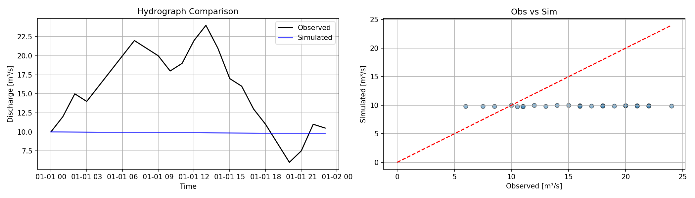

# Hydrological Model Evaluation Report

## Summary
| Metric | Value |
| :--- | :--- |
| NSE | -1.2498 |
| KGE | -0.2290 |
| RMSE | 7.5323 |
| Bias | -36.3037 |
| R | 0.3643 |
| logNSE | -1.1112 |

## Plot

